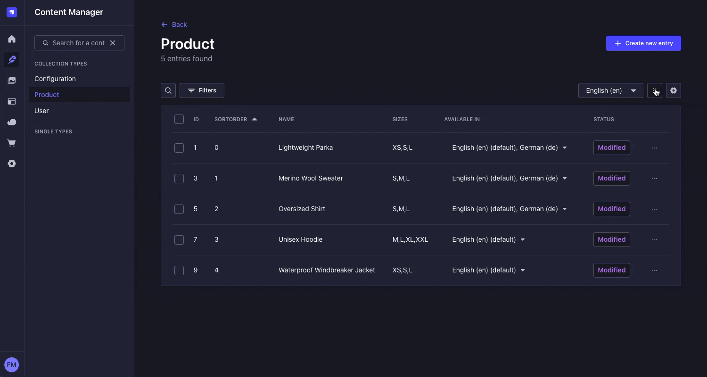
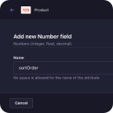
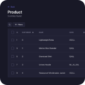

# Strapi Plugin: Sortable Entries



A Strapi plugin that enables drag-and-drop sorting of entries within a collection type.

## ⏳ Installation

Install with NPM.

```bash
npm install strapi-plugin-sortable-entries --save
```

Install with Yarn.

```bash
yarn add strapi-plugin-sortable-entries
```

## 🔧 Usage

### 1. Configure the Plugin

Add the following configuration to your `config/plugins.ts` file. Create the file if it doesn’t already exist:

```ts
export default {
  // …
  'sortable-entries': {
    enabled: true,
  },
};
```

Then restart the app to apply the changes.

### 2. Use in the Admin Panel

1. Add a field named `sortOrder` of type `integer` to the collection type you want to make sortable.

2. Configure the view of that collection type:
   - Set `sortOrder` as the **Default sort attribute**.
   - Choose **ASC** as the **Default sort order**.

3. To start sorting entries, click the **Drag** icon located next to the **Settings** icon in the top-right corner.

4. A modal will appear, allowing you to drag and drop entries into your desired order.
   - The displayed title for each entry is the **Entry title** defined in your collection type.
   - You can configure the entry title by editing a single entry and selecting **Configure the view** from the three-dot menu (`...`).

5. Click **Submit** to save the new order. The modal will close and the list will refresh to reflect the changes.

**Note:** When adding new entries, you may leave the `sortOrder` field blank or even hide it in the Admin Panel. The plugin will automatically assign a value that places the new entry at the end of the list.

### 3. Use in the Frontend

To retrieve entries in the specific order from the frontend, you can make a GET request to the Strapi API. In the example below, we're querying a content type called `products`, ordered by the `sortOrder` field in ascending order:

```http
GET http://localhost:1337/api/products?sort=sortOrder
```

- `products`: The name of the content type you want to fetch.
- `sort=sortOrder`: Sorts the results by the `sortOrder` field in ascending order. Append `:desc` for a descending order.

## 📸 Screenshots

Below are screenshots from an example application using this plugin to sort products.

<a href="./assets/content-type-builder.png"/></a>&nbsp;&nbsp;<a href="./assets/content-manager-configure-the-view.png"/></a>&nbsp;&nbsp;<a href="./assets/content-manager-list-view.png"/></a>&nbsp;&nbsp;<a href="./assets/content-manager-list-view-sort-entries.png"/></a>
